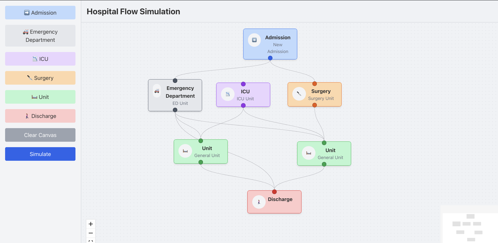
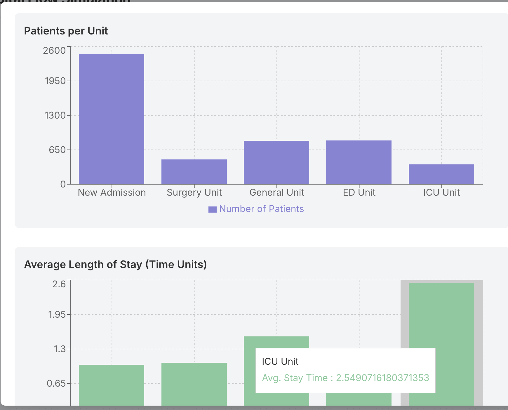

# Hospital Flow Simulator
Bharat Khanna

This was a simple learning example to build a full stack React and FastAPI app to simulate the flow of a psuedo hosptial system.

It's by design simplistic and not meant for production purpose, but stil illustrate the interconnectivity between the two applications.




## Structure

There's a reverse proxy that will serve the frontend and FastAPI backend.

## Running the app

```bash
docker-compose up --build
```
* Access the frontend at: /
* API docs at: /api/docs

##  License 
[Creative Commons Non Commercial 4](https://creativecommons.org/licenses/by-nc/4.0/)
